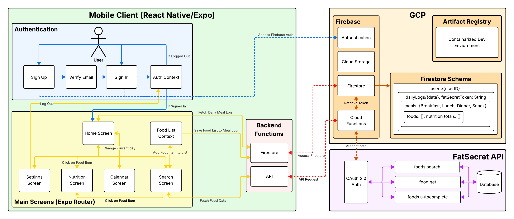

  

  <em>Track with ease, savor simplicity</em>

---

# 🍽️ **Clear Meals: A Comprehensive Mobile Meal Tracker**
Clear Meals is a robust, user-friendly mobile application designed to help users track their daily food intake, monitor nutritional information, and maintain a healthy lifestyle. Built with React Native and Expo, this app offers a seamless experience for logging meals, searching for foods, and analyzing nutritional data.

Video Demo: [https://youtu.be/OQB6ncvmeXg](https://youtu.be/OQB6ncvmeXg)

---

## 🌟 Features
- **User Authentication**: Secure sign-up, sign-in, using email verification system or google.
- **Food Search**: Powered by the FatSecret API for an extensive database of food items.
- **Meal Logging**: Easy-to-use interface for adding foods to different meal types (Breakfast, Lunch, Dinner, Snack).
- **Nutritional Information**: Detailed nutritional breakdown for each food item and meal.
- **Daily Log**: Comprehensive view of daily food intake and nutritional totals.
- **Calendar View**: Historical data of meal logs with an interactive calendar.
- **Customizable Serving Sizes**: Adjust serving sizes and see real-time nutritional updates.
- **User Profile Management**: Account settings and data management options.

---

## 🛠 Technologies Used
- **React Native**: Core framework for building the mobile application.
- **Expo**: Development platform for easy building and deployment.
  - EAS Workflows for automating the deployment of new releases
- **Firebase/GCP**: 
  - Authentication for user management.
  - Firestore for database storage.
  - Cloud Functions for secure API interactions.
  - Cloud Storage for user profile picture storage.
  - Artificat Registry for storing the containerized dev enviornment.
- **FatSecret API**: Extensive food database and nutritional information.
- **TypeScript**: For type-safe code and improved developer experience.

---

## 📲 Try It Out!
1. **Download**: Install the latest APK from [here](https://github.com/Mark-Bosco/clear-meals-1660/releases/) onto your Android device.
2. **Sign Up/Sign In**: Create an account or sign in to an existing one.
3. **Email Verification**: Verify your email address to access all features.
4. **Home Screen**: View your daily food log and total calorie intake.
5. **Add Food**: 
   - Tap "Add Food" and select a meal type.
   - Search for food items using the search bar.
   - Select a food item to view nutritional information.
   - Adjust serving size if needed and tap "Save" to add to your meal.
6. **View Nutritional Details**: Tap on any logged food item to see detailed nutritional information.
7. **Edit/Delete Foods**: Swipe left on a food item in your daily log to delete it. Click on an item to edit it.
8. **Calendar View**: Access the calendar icon to view your meal history and edit any daily logs.
9. **Settings**: Manage your account settings and log out.

---

## 📚 API Information
The app uses the FatSecret API for food data. Key endpoints include:
- `foods.search`: Search for food items.
- `food.get`: Retrieve detailed information about a specific food item.
- `foods.autocomplete`: Get autocomplete suggestions for food searches.
- All fatsecret Platform REST API requests are signed using OAuth 2.0

For full API documentation, visit [FatSecret Platform API](https://platform.fatsecret.com/docs/guides).

---

## 📐 Architecture Diagram

  

- Dotted Lines: External Communication
- Solid Lines: Internal Communication

--- 

## Team and Responsibilities
- Mark Bosco - Documentation, Demo, Architecture Diagram, GCP Services (Firebase Authentication, Firestore, Cloud Run)
- Mason Mcginnis - Deployment Automation
- Henry Uz - Deployment Automation
- Siddarth Surana - GCP Services (Artifact Registry)
- Daniel Evans - GCP Services (Cloud Storage)
- Sloane McCensky - Authentication Layer

# **🧑‍💻 For Developers Only! 👩‍💻**

---

## 📃 Prerequisites
- [Node.js (version 14 or later)](https://docs.npmjs.com/downloading-and-installing-node-js-and-npm)
- npm or yarn
- [Expo CLI](https://docs.expo.dev/more/expo-cli/) (install globally via `npm add expo`)
- [Firebase CLI](https://firebase.google.com/docs/cli/) (if you plan to work on backend functions `install via npm install -g firebase-tools`)

--- 

## 👶 Initial Setup
1. Navigate to where you want to store the project
2. Clone the repository and enter the directory
    - `git clone https://github.com/Mark-Bosco/clear-meals-1660.git`
    - `cd clear-meals-1660`
3. In the project root, install the main project dependencies
    - `npm install`
4. If working on Firebase functions, navigate to the functions directory and install its dependencies:
    - `cd functions`
    - `npm install`
    - `cd ..` (Move back to the root directory)

--- 

## 🕵️ Configuring Secrets and Enviornment Variables
1. Pull up the Google doc I have shared containing the secrets
2. Create a `.env` file and paste in the contents
    - *This is an environment variables file containing configuration keys for Firebase and OAuth authentication*
3. Create a `google-services.json` file and paste in the contents
    - *This is the Firebase configuration file specifically for Android applications*
4. Create a `serviceAccountKey.json` file and paste in the contents
    - *This is a Firebase Admin SDK credential file used for server-side authentication*
5. Create a `GoogleService-Info.plist` file and paste in the contents
    - *This is the Firebase configuration file specifically for IOS applications*

--- 

## 🚗 Running the Project
1. Start the Expo Development Server by entering the following command while in the project root:
    - `npx expo start`
2. Use an emulator or the Expo Go app on your mobile device to preview the application
    - Both IOS and Android are supproted
    - There may be some visual bugs on IOS
    - You may get native code errors if running in Expo Go as the native libraries are not available. Use a native development build to test Google sign in functionality. 

--- 

## ☁️ Firebase Functions 
1. If your work involves backend updates, log in to Firebase:
    - `firebase login`
2. Make your code changes in `/functions` and commit them to GitHub
3. Deploy the new or updated functions with: `firebase deploy --only functions`

## 🔒 Google Authentication
1. Using a Google Authentication method requires additional configuration of the app in Firebase console. Follow the instructions [in the authentication library docs](https://react-native-google-signin.github.io/docs/setting-up/get-config-file) to configure Firebase and Google Authentication for your platform and build method.
2. Google Authentication only works with a native build locally or on EAS, not Expo Go, for Android, as it requires native libraries.

--- 

## 🏗️ Creating a New Build
1. Create an Expo account and join the 1660 organization
2. Install the Expo EAS CLI using this terminal command: `npm install -g eas-cli`
3. Login to your Expo account in the terminal: `eas login`
4. Increment `version` in `app.config.js` (i.e. 1.0.0 --> 1.0.1)
5. Make sure all your changes are committed to git
7. Run the build command: `eas build --platform android --profile preview`
    - Use the exisiting keystore if prompted
    - If you run into issues regarding secrets, temporarily adjust the `.gitignore` as indicated by the comments
    - Check the progress of the build [here](https://expo.dev/accounts/cs1660/projects/clear-meals-1660/builds)
